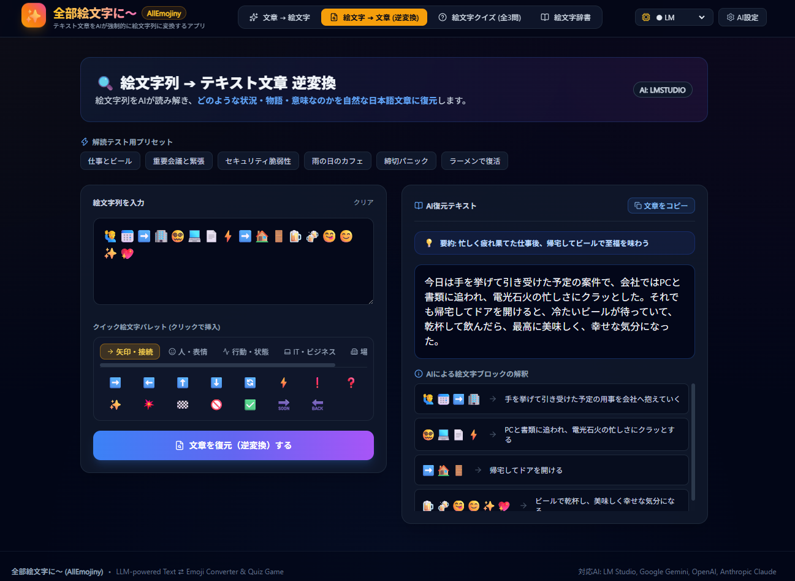
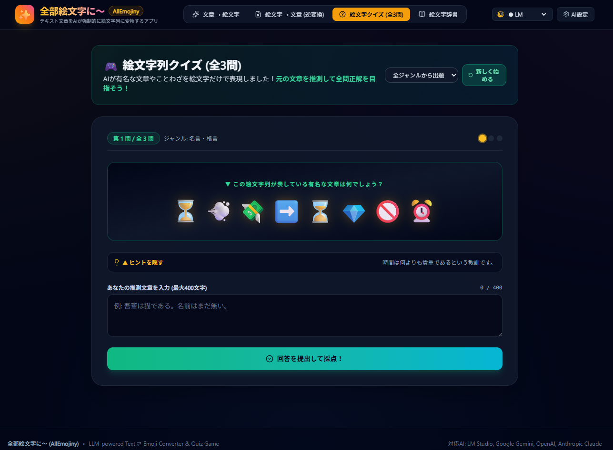

# 全部絵文字に〜 (AllEmojiny) ✨

[](LICENSE)
[](package.json)
[](tsconfig.json)
[](package.json)

テキスト文章を生成AI（LLM）に解釈させて、**文字を一切使わず強制的に絵文字列だけで表現する**エンタメ＆実用Webアプリケーションです。
絵文字列から元の文章を復元する「逆変換機能」や、絵文字の暗号を解読する「絵文字列クイズゲーム」も搭載しています。

ローカル環境（localhost）での利用を前提としたパーソナルユースアプリケーションです。

バイブコーディングによる開発です。

## 既知の問題

AIプロバイダーについて、OpenAI APIとAnthropic APIの接続確認は実施していません。

## 🌟 主な機能

### 1. 📝 テキスト文章 → 絵文字列 変換 (Text to Emoji)
- 任意の日本語・テキスト文章（最大2000文字）をAIが深く解釈し、絵文字のみのシーケンスに強制変換
- **3段階ハイブリッド変換パイプライン**:
  - **第1段階（意味・構文解析）**: 主語、時間・時系列、場所、行動・出来事、感情、抽象概念を抽出
  - **第2段階（辞書＋連想）**: 豊富な日本語絵文字辞書との照合＆連想マッピング
  - **第3段階（絵文字再構成）**: 順序記号（➡️, ⬇️）等と組み合わせた最終シーケンスの構成
- **3つの変換モード**:
  - 🎯 **正確モード**: できるだけ意味と時系列を忠実に維持
  - 🔨 **強引モード**: 存在しない概念（例: 「脆弱性」→🕳️🔓、「分析」→🔍🧠）も比喩・連想で無理矢理絵文字化
  - 🌀 **カオスモード**: 意味を多少犠牲にしても最も面白くシュールな絵文字列を出力
- 各絵文字の意味・対応表（内訳カード）やパイプライン思考プロセスの可視化（Pipeline Inspector）


### 2. 🔍 絵文字列 → テキスト文章 逆変換 (Emoji to Text)
- 絵文字列をAIが観察し、そこに込められた状況・ストーリー・感情を自然な日本語文章へ復元
- クイック絵文字パレット（カテゴリ別の絵文字ピッカー）で直感的な入力が可能
- AIによる一言要約や、絵文字ブロックごとの解釈理由を表示



### 3. 🎮 絵文字列クイズゲーム (Emoji Quiz)
- 有名な文学作品（吾輩は猫である、走れメロス等）、ことわざ・格言、日本昔話、世界の名言から全3問出題
- ユーザーが推測した文章（最大400文字）を入力し、AIがセマンティックに近似度を採点（0〜100点）
- 正解・惜しい・不正解のフィードバック、元文章の解説
- 全問正解時の大絶賛メッセージ＆紙吹雪（Confetti）アニメーション
- スコア結果のクリップボードコピー＆SNSシェア機能



### 4. 📖 絵文字辞書 & 連想ルール (Dictionary)
- 内蔵された豊富な絵文字辞書（人・時間・場所・行動・感情・IT/ビジネス・食べ物・記号等）の検索・閲覧
- ユーザーによるカスタム単語・絵文字ルールの追加登録・削除

### 5. ⚙️ マルチAIプロバイダー対応 (Multi-LLM Settings)
- **LM Studio**: ローカルLLM（`http://127.0.0.1:1234/v1`、完全オフライン・高速・無料）。例: `qwen2.5-7b-instruct`, `gemma-2-9b-it`, `llama-3.2-3b-instruct`, `deepseek-r1-distill-qwen-7b` 等、LM Studioにロードした任意のモデル
- **Google Gemini**: `gemini-3.6-flash`（デフォルト）等、Gemini APIキーで利用可能なモデルを自動取得
- **OpenAI**: `gpt-4o-mini`（デフォルト）, `gpt-4o`, `o1-mini`, `gpt-3.5-turbo`
- **Anthropic**: `claude-sonnet-4-5-20250929`（デフォルト）, `claude-opus-4-1-20250805`, `claude-haiku-4-5-20251001`, `claude-3-7-sonnet-20250219`, `claude-3-5-sonnet-20241022`, `claude-3-5-haiku-20241022`
- Web UIからのワンクリック接続テスト、利用可能モデル一覧の自動取得、SQLite（WAL mode）による安全なローカル設定保存

> モデル一覧は各プロバイダーのSDK/APIの更新に伴い変わる可能性があります。最新の対応状況は [server/services/llm](server/services/llm) 配下の各Providerクラス（`popularModels` / `defaultModel`）をご確認ください。

---

## 🛠️ 技術スタック

- **フロントエンド**: React 19, TypeScript, Vite, Tailwind CSS, Lucide React, Canvas-Confetti
- **バックエンド**: Node.js, Express, TypeScript, TSX, node:sqlite (WAL mode), Helmet, express-rate-limit
- **AI SDK**: OpenAI SDK, @anthropic-ai/sdk, @google/generative-ai, Fetch API

---

## 🔒 セキュリティについて

本アプリは **localhost専用**（外部公開を想定しない個人利用アプリ）として設計されており、以下の多層防御を実装しています。

- **CORS制限**: `localhost` / `127.0.0.1` からのアクセスのみ許可
- **CSRF対策**: 状態変更リクエスト（POST/PUT/PATCH/DELETE）に対するOrigin/Refererの検証
- **Helmet**: セキュリティ関連HTTPヘッダーの付与
- **レート制限**: `express-rate-limit` によるAPI呼び出し回数の制御
- **ローカル設定保存**: APIキー等の設定は `node:sqlite`（WALモード）でローカルに保存し、外部送信は行いません

外部ネットワークに公開する場合は、追加の認証・アクセス制御を必ず実装してください。

---

## 🚀 起動方法

### 前提条件
- Node.js v18以上（v20 / v22 / v26 推奨）
- （ローカルLLMを使用する場合）LM Studio 等のOpenAI互換サーバー

### リポジトリの取得
```bash
git clone https://github.com/h-sugah/AllEmojiny.git
cd AllEmojiny
```

### 開発サーバーの起動
```bash
# 依存関係のインストール
npm install

# サーバー(3001)とフロントエンド(5173)を同時起動
npm run dev
```

ブラウザで `http://localhost:5173` にアクセスしてください。

### 本番ビルドと実行
```bash
# ビルド
npm run build

# 本番サーバー起動 (ポート 3001)
npm start
```

ブラウザで `http://localhost:3001` にアクセスしてください。

### AIプロバイダーの設定

各AIプロバイダーのAPIキー等は、起動後にWeb UIの設定画面から入力するか、`.env.example` を参考に `.env` ファイルを作成して設定できます。

```bash
cp .env.example .env
```

---

## 📄 ライセンス

このプロジェクトは [Apache License 2.0](LICENSE) の下で公開されています。
